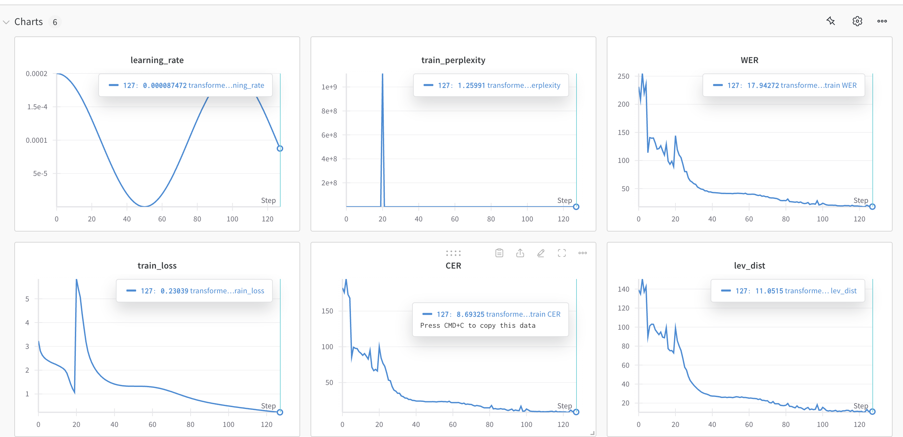
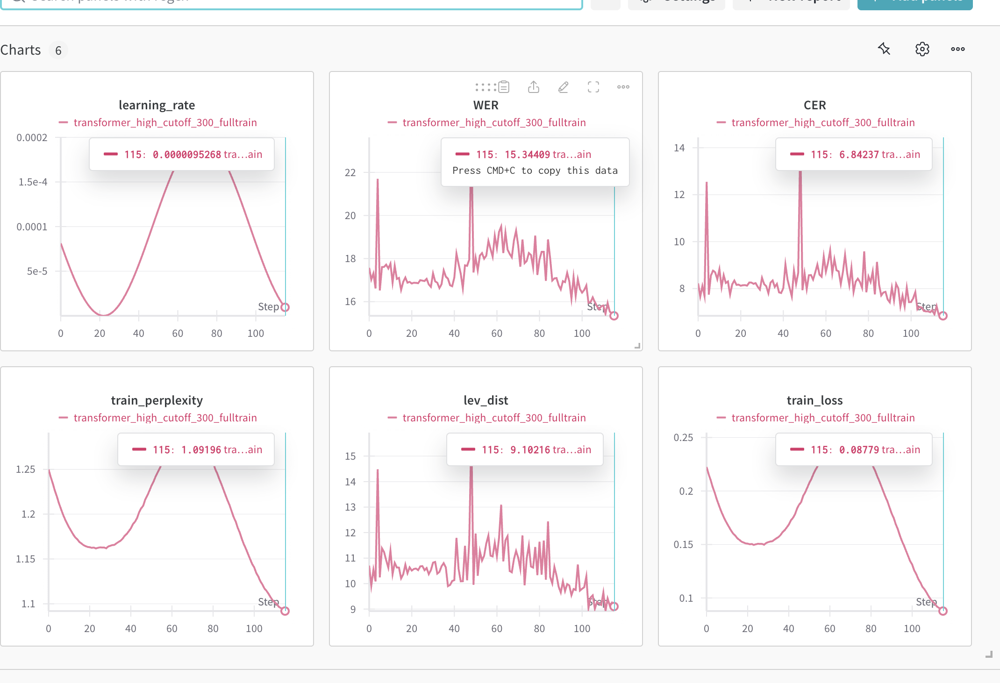

<!-- Guidelines:

Submit the code that corresponds to your highest submission on Kaggle. All code files should be zipped into a single tar file (handin.tar). Please do not include the model ‘.pth’ files, dataset files, or anything else that is not relevant to your code submission.

If you wrote multiple Python scripts and ran them from a single main.py or similar, all these files should be present in the handin.tar. We also need you to submit a 1-page README file (which should be included in handin.tar as well) that contains instructions on how to run your code. You should also include details about the experiments you ran, architectures you tried, the number of epochs you trained for, hyperparameters you used (and specify which combination resulted in the best score), as well as your data loading scheme.

If you wrote your code in a single notebook (.ipynb file), you can write the instructions on how to run your code and other architecture details (mentioned in the previous point) in the markdown cells in the notebook itself. You can then zip the notebook as handin.tar and submit that to Autolab.

(Optional, but recommended) If you mentioned all your experiments in an Excel sheet, then please submit that as well in the handin.tar. In case you used wandb, you can share the link through the above form or include screenshots in the README file.

We will grant you the maximum marks possible after considering all your submissions, i.e., on-time, slack, and late submissions. If your maximum marks come out to be the same across multiple submissions, we will consider the one that minimizes your slack days.
-->
### Instruction
I have multiple python files and to get the result that correspond to my highest point submission, I run the 
shell script using command `sbatch slurm_run_hw4p2.sh` and `sbatch slurm_predict.sh`

I breakdown the starter notebook into `dataset.py` `hw4p2_c.py` `metrics.py` `misc.py` `model_mask.py` `trans.py` `tokenizer.py` `train_val_test_step.py` `prediction.py`  `slurm_predict.sh` `slurm_run_hw4p2.sh` the `prediction.py` files is only used for me to load some already trained checkpoint and output the excel file. 

### Ablation Tested

1. For num_feat: I tried different num_feat from `20`, `30`, `40`, to `60` and `70` and found that `70` performs the best
2. I tried using batch_size of `64`, `32`, and `16` and found that `16` is the best
3. i tried using `num layer / numhead` of `4/4`, `4/6`, `6/8` and find that `6/8` works the best
4. The schedulear I use is `CosineAnnealing` I tried using T_max that is `300` (same as epoch size) and tmax of `60` and `50`. I think using smaller `Tmax` works better for me 
5. I tried `ctc_weight` of `0.35` and `0.5` and found that `0.5` works better. 
6. for time masking, i tested `time_mask_width_range` of `50` and `10`, `10` do better
7. for normalization i tried both `cepstral` and `global_mvn`, `cepstral` works better. 
8. for decoding, I tried implementing beam search to replace greedy search but the implementaton is not very successful so i ended up not using it. 
### Wandb:
initial run:

resumed run:
